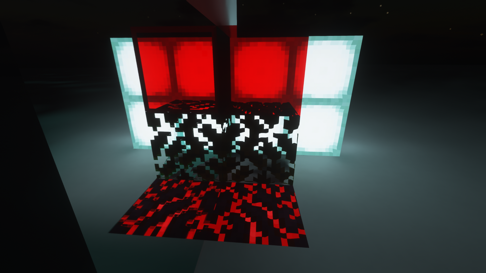
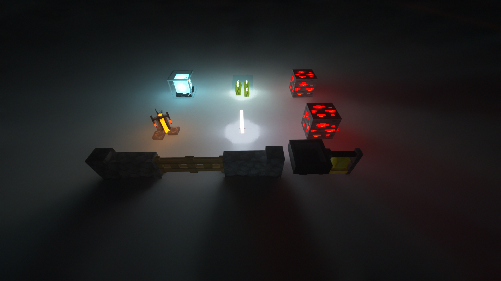
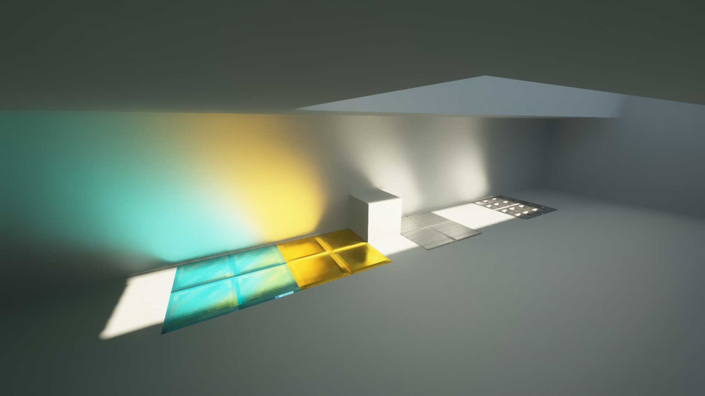

# SEUS PTGI GeForceLegend's Modified Edition

A deeply modified version of SEUS PTGI

## Features

### Per-pixel rendering in path tracing, include cutout, transpanret and even PBR support

### More colored vanilla lighting sources and block shapes

### Auto texture resolution, better support for incomplete texture packs

### Metal sunlight caustics

### Many more small fixes and improvements for vanilla PTGI...

## Install

### Due to PTGI's EULA, its illegal to distribute PTGI's code directly, so you need to follow these steps to extract SEUS PTGI GFME

1. Download the jar file from release page, and download a **vanilla unedited SEUS PTGI HRR Test 2.1.zip** from [Cody's Patreon page](https://www.patreon.com/sonicether/posts) if you don't have one.

2. Put the jar file and PTGI HRR 2.1 file into the same path, and double click the jar file. If everything is fine, there will be a new folder (older version of GFME) or a zip file (newer GFME version) that can be used directly as a shaderpack by moving this file or folder into .minecraft/shaderpacks.

If there is nothing happened while double clicking jar, you can run this jar in CMD or Powershell by `java -jar "<your GFME jar path>"` for more information.
